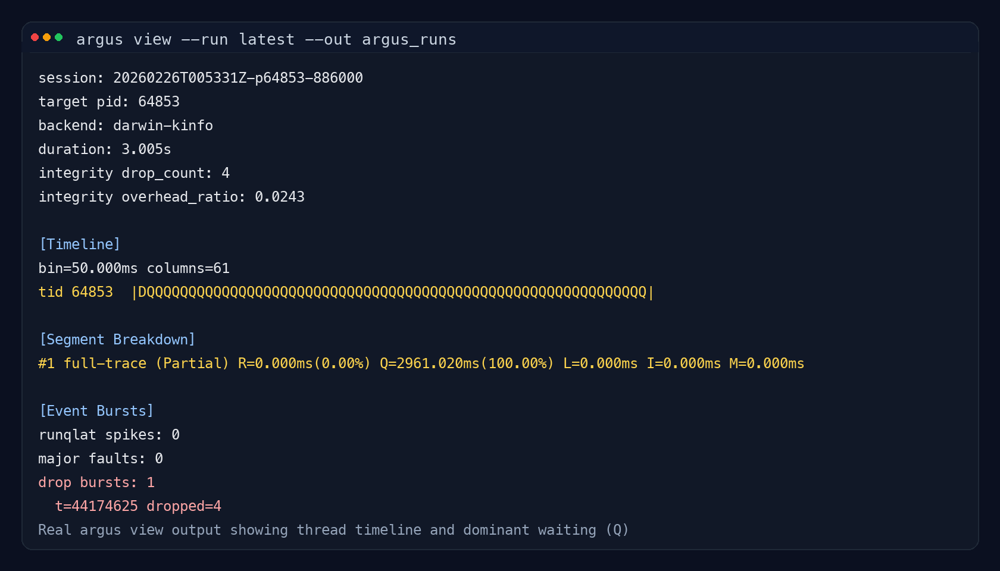

# Argus v0.2 MVP


Argus is an execution observatory that shows where a process actually waits.
It explains latency that CPU metrics and profilers cannot.

Not CPU usage.  
Not function timing.  
Waiting.

## When should I use Argus?

Use Argus if you have experienced:

- The service is slow but CPU usage is low
- Random latency spikes you cannot reproduce
- Logs show nothing unusual
- Profilers show no hotspot
- The system "sometimes pauses" for no reason

Most real performance problems are not computation problems.

They are waiting problems.

## What makes Argus different?

| Tool | Shows |
|------|------|
| top / htop | resource usage |
| perf / flamegraph | CPU execution time |
| logs | application events |
| **Argus** | why execution stopped |

Argus does not measure how busy your CPU is.

Argus shows why your program cannot run.

## Example finding

A process appeared idle in system monitors.

Argus trace showed:

- Running time: ~0 ms
- Waiting for CPU: ~96%

The program was not slow because it was computing.
It was slow because it never got scheduled.

This type of issue is nearly invisible in metrics and logs.

This means the bottleneck was not in the application code,
but in scheduling contention outside the program.

## Try it in 10 seconds

Download a prebuilt binary and run:

```bash
curl -L https://github.com/tongro2025/Argus/releases/latest/download/argus-linux-amd64 -o argus
chmod +x argus
sudo ./argus run --pid <PID> --duration 5s --out argus_runs
```

(No build required)

## Quick Start

```bash
# Build
GOCACHE=$PWD/.gocache GOMODCACHE=$PWD/.gomodcache go build -o ./argus-go ./cmd/argus

# Help
./argus --help

# One-command run
./argus run --pid <PID> --duration 10s --out argus_runs
```

Platform-specific launchers:

- Linux/macOS/WSL: `./argus run --pid <PID> --duration 10s --out argus_runs`
- Windows CMD: `argus.cmd run --pid <PID> --duration 10s --out argus_runs`
- Windows PowerShell: `./argus.ps1 run --pid <PID> --duration 10s --out argus_runs`

## What it looks like



Each thread state is reconstructed on a timeline.
You can directly see when execution was running and when it was blocked.

## Core Features

- `trace`: capture PID session data
  - `machine.json` + fingerprint
  - `events.bin` (fixed header/record layout)
  - `argus_meta.sqlite` (session/segment/integrity/state intervals)
  - `summary.json`
- `view`: terminal timeline and segment summary
- `export`: export Perfetto JSON
- `report`: summarize outputs from `summary.json` (text/json)
- `run`: one-command pipeline (`trace -> view -> export -> report`)

## What Is PID?

`PID` means Process ID.
In Argus, `--pid` specifies which process to observe.

Example:

```bash
echo $$
./argus run --pid <PID> --duration 10s --out argus_runs
```

## Main Commands

```bash
# trace
./argus trace --pid <PID> --duration 10s --out argus_runs

# view
./argus view --run latest --out argus_runs

# export
./argus export --run latest --format perfetto --out argus_runs/latest.perfetto.json

# report (text)
./argus report --run latest --out-root argus_runs

# report (json)
./argus report --run latest --out-root argus_runs --format json --save argus_runs/latest.report.json

# one command
./argus run --pid <PID> --duration 10s --out argus_runs --report-format json
```

## Measurement Integrity Summary

Argus always includes three integrity groups in session output:

- Drop Integrity: event loss amount and affected windows
- Overhead Integrity: observer CPU/scheduling/context-switch/I/O overhead
- Coverage Integrity: explicitly reported unobservable items

Most profilers assume the measurement is correct.
Argus reports how reliable the measurement actually is.

## Developer Reference

### Output Layout

```text
argus_runs/
  <session_id>/
    machine.json
    machine.sha256
    argus_meta.sqlite
    events.bin
    summary.json
    report.txt|report.json
    export/
      perfetto_trace.json
```

### Build Scripts

```bash
./scripts/build_all.sh
```

```powershell
./scripts/build_all.ps1
```

## Documentation Language Policy

English is the primary language of this repository.
The root `README.md` is the main entry point, and Korean counterparts are maintained under `docs/`.

- English (Primary)
  - [README.md](README.md)
  - [Argus v0.2.en.md](docs/Argus%20v0.2.en.md)
  - [Argus_observer_integrity.en.md](docs/Argus_observer_integrity.en.md)
- Korean
  - [README.md (Korean)](docs/README.md)
  - [Argus v0.2.md](docs/Argus%20v0.2.md)
  - [Argus_observer_integrity.md](docs/Argus_observer_integrity.md)

## License

Licensed under Apache License 2.0.

- [LICENSE](LICENSE)
- [NOTICE](NOTICE)

## Real Measurement Backends by Platform

- Linux/WSL: `/proc` thread-level sampling
- macOS: `kinfo_proc(sysctl)` process-level sampling
- Windows: Win32 API (`GetProcessTimes` + Toolhelp) process-level sampling

Notes:

- Simulation backend has been removed.
- eBPF CO-RE integration is outside the current MVP scope.

Argus is not a performance optimizer.

It is a tool for understanding execution.
