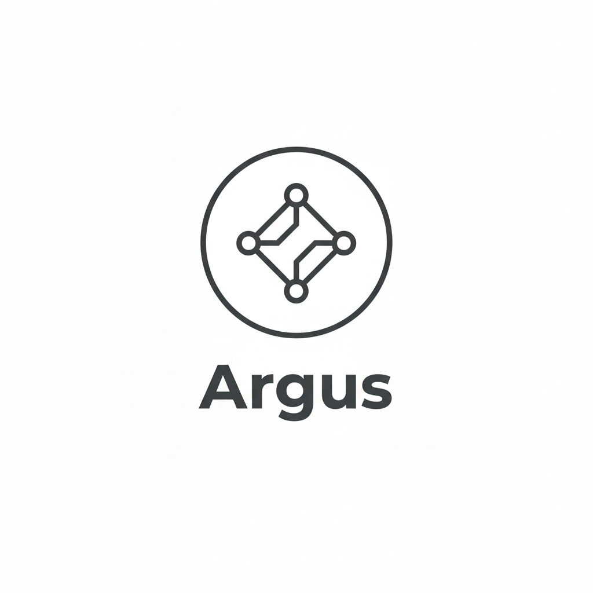

# **Argus v1.0 — Execution Observatory Architecture**



**(Reproducible Observation Protocol / Config-driven Runs / Report Regeneration / Sanitized Sharing / Integrity-aware Interpretation)**

Korean version: [Argus v1.0.md](Argus%20v1.0.md)

---

## **0. One-line Definition**

**Argus v1.0 is an execution observatory protocol that records reproducible observation artifacts under identical conditions, then regenerates and shares reports with explicit integrity boundaries.**

v1.0 does not present itself as a performance optimizer.
It is a reproducible measurement and reporting protocol.

---

## **1. Why v1.0 Changed**

Argus v0.2 established a waiting-centric observability architecture.
Argus v1.0 keeps that philosophy but changes the product contract:

- from PID-first operational tracing to **protocol-first reproducible runs**
- from ad-hoc result reading to **artifact contract + report regeneration**
- from local-only outputs to **sanitized shareable validation packages**

---

## **2. v0.2 to v1.0: Architectural Delta**

| Area | v0.2 | v1.0 |
|---|---|---|
| Primary orientation | PID-centric capture architecture | Reproducible validation protocol |
| Main entry | `trace/view/export/report/run` around PID and duration | `doctor/run/report/export` around `config.yaml` and run directories |
| Core output contract | event timeline + integrity context | reproducible record set (`metrics.json`, `report.md`, `run_meta.json`, config snapshot) |
| Reusability of results | session analysis-oriented | explicit report regeneration without re-measurement |
| Sharing model | local artifacts | `export --sanitize` for external validation sharing |
| Reliability language | observer effect and integrity | integrity + stability judgment + interpretation boundaries |
| Claim boundary | execution waiting visibility | reproducibility of observation and reporting under identical conditions |

---

## **3. v1.0 System Architecture**

```text
[argus doctor]
  -> environment eligibility checks
     (platform/permission/runtime readiness)

[argus run <config.yaml>]
  -> config resolution
  -> warmup phase (excluded from final statistics)
  -> repeated observation runs
  -> metrics aggregation + integrity accounting
  -> run directory write

[Run Directory]
  - metrics.json
  - report.md
  - run_meta.json
  - resolved_config.yaml (or equivalent snapshot)

[argus report <run_dir>]
  -> regenerate report from existing records
     (no new measurement)

[argus export <run_dir> --sanitize]
  -> create shareable package
  -> redact personal/environment-identifying context
```

---

## **4. v1.0 CLI Contract**

```bash
argus doctor
argus run <config.yaml>
argus report <run_dir>
argus export <run_dir>
argus export <run_dir> --sanitize
```

Command semantics:

- `doctor`: pre-run eligibility check for reproducible protocol execution
- `run`: execute protocol-defined observation run and emit run artifacts
- `report`: regenerate human-readable report from existing run artifacts
- `export`: package artifacts for transfer
- `export --sanitize`: package artifacts with sensitive fields redacted

---

## **5. Protocol Config Model**

Representative fields:

- `seed`
- `steps`
- `repeat`
- `warmup_steps`
- `workload.*`

Design intent:

- warmup is measured for execution continuity but excluded from final comparison statistics
- repeat-based runs are first-class for variability observation

---

## **6. Artifact Contract (v1.0)**

Required record files:

- `metrics.json`: raw protocol metrics and derived summaries
- `report.md`: human-readable interpretation with stability-aware wording
- `run_meta.json`: environment/runtime metadata and protocol context
- `resolved_config.yaml` (or equivalent): resolved run configuration

Validation point:

- success is defined by reproducible artifact generation and report regeneration
- numeric superiority is not the validation target

---

## **7. Integrity and Stability Model**

v1.0 preserves and extends integrity-oriented interpretation:

- **Drop/Coverage/Overhead integrity** remain foundational
- **Stability check** is explicit via dispersion-aware outputs (Mean/Std Dev/Min/Max)
- high variability can be flagged as noise-dominated, preventing over-interpretation

---

## **8. Sanitized Export as a First-class Capability**

`argus export <run_dir> --sanitize` supports validation sharing by redacting:

- usernames
- absolute user-home paths
- hostnames
- environment-variable assignments
- IP addresses

This lowers reviewer friction for third-party reproducibility checks.

---

## **9. Interpretation Boundary (v1.0)**

What v1.0 protocol execution means:

- observation records were produced under a declared run protocol
- reports can be regenerated from the same records
- variability and integrity context are preserved

What it does not mean:

- no claim of performance improvement
- no claim of model-level superiority
- no claim tied to a specific hardware advantage

---

## **10. Migration Notes for v0.2 Readers**

If you started with v0.2 architecture documents:

- keep the waiting/integrity mental model
- shift operational focus from PID session inspection to run protocol reproducibility
- use `doctor -> run -> report -> export --sanitize` as the default validation path

v1.0 is a contract upgrade, not a philosophical reset.
